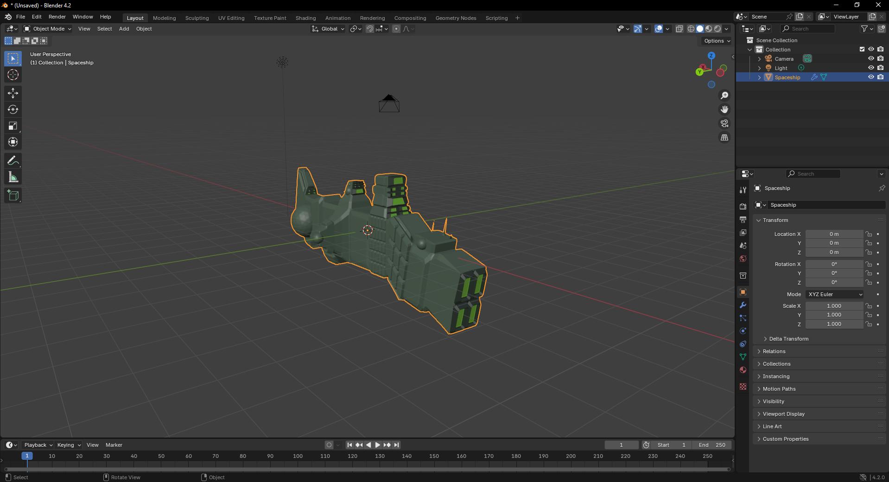
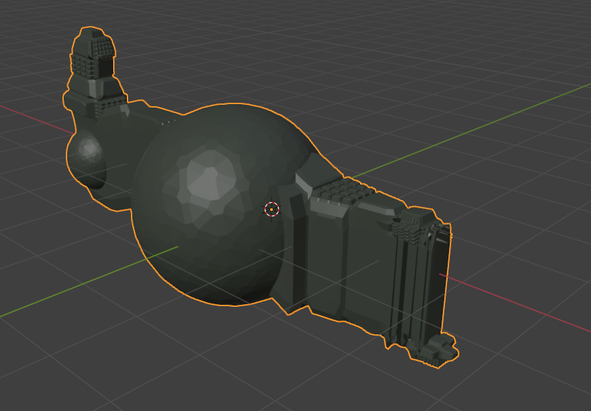
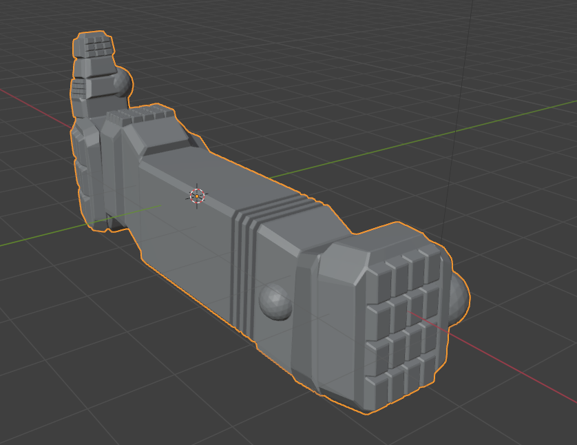

# BlenderProcGen Spaceship Generator in Blender 4.2

A Blender script to procedurally generate 3D spaceships from a random seed. `Nokota Mustang` has forked this, from Michael Davies, to update it to work with Blender 4.2.

It's working but I had to butcher some of the texture on the materials -- will update as soon as I can figure out how to update the code.

Also I had to disable the input controls for now, should be able to get that working soon.

I will add new features when I get the hang of it.

## Usage

- Install Blender 4.2: <http://blender.org/download/>
- Download newest **add_mesh_SpaceshipGenerator.zip** from the Releases.
- Under `Edit > Preferences > Add-ons > Install` From Disk then pick the release zip file.
- Add a spaceship in the 3D View under `Add > Mesh > Spaceship`
- The script will delete all objects starting with `Spaceship` before generating a new spaceship.

## How it works

- Start with a box.
- Build the hull: Extrude the front/rear faces several times, adding random translation/scaling/rotation along the way.
- Add asymmetry to the hull: Pick random faces and extrude them out in a similar manner, reducing in scale each time.
- Add detail to the hull: Categorize each face by its orientation and generate details on it such as engines, antenna, weapon turrets, lights etc.
- Sometimes apply horizontal symmetry.
- Add a Bevel modifier to angularize the shape.
- Apply materials to the final result.
- Take over the universe with your new infinite fleet of spaceships.
